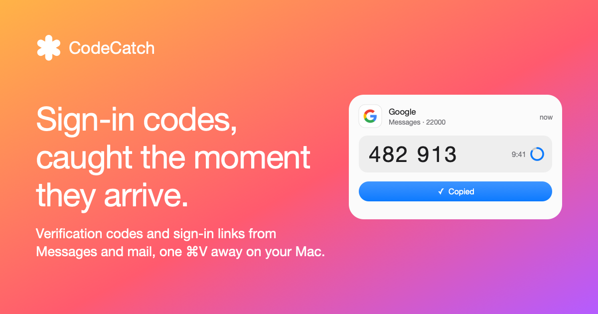

<div align="center">
  <h1>CodeCatch</h1>
  <p><em>Sign-in codes, caught the moment they arrive.</em></p>
  <p>
    <a href="https://github.com/ugzv/CodeCatch/actions/workflows/ci.yml"></a>
    <a href="https://github.com/ugzv/CodeCatch/releases/latest"></a>
    <a href="LICENSE"></a>
    
  </p>
  <p><a href="https://codecatch.app/download/CodeCatch.dmg"><b>Download for Mac</b></a> · <a href="https://codecatch.app">codecatch.app</a> · <a href="https://codecatch.app/privacy/">Privacy</a> · <a href="https://codecatch.app/changelog/">Changelog</a></p>
  
</div>

A Mac menu bar app that catches 2FA verification codes and sign-in
links the moment they arrive in **Messages** (iMessage + forwarded SMS) or your
**mail** (the Mail app's inboxes, Gmail or any IMAP server), and puts them on the clipboard, one ⌘V away.

- **Banner** slides in at the top right: service, source, the code and **Copy**.
  It never steals focus, so the field you were typing in stays active. Hover to
  keep it open.
- **Auto-copy**: a new code is already on the clipboard and is cleared after 90 s
  if you didn't copy anything else. Every copy (codes, sign-in links, messages)
  stays on this Mac, never Universal Clipboard, and is marked concealed and
  transient to ask clipboard managers not to record it. Other apps can still read the clipboard.
- **Automatically Type Codes** (optional, off by default): types a new code into the
  field that has focus, as real key presses, so one-box-per-digit fields fill too.
- **Menu bar** shows a fresh code for 3 minutes; the popover lists recent codes
  (7 days by default): click to copy, right-click for more.
- **Saved logins**: unlock with your Mac password (or Touch ID when available), then search received
  codes and Bitwarden logins together by service, account or site. Exact matches
  rank first among live results; expired codes move below them. Pin logins from
  their right-click menu; pinned and recently copied logins appear above history.
- **Monitoring controls**: Settings → Monitoring independently enables received
  verification codes, sign-in links and Bitwarden authenticator codes. Turning off
  both received types pauses Messages and mail. Disabling Bitwarden keeps the
  saved import and locks the app; re-enable and unlock to use it again. Each mail
  account also has a switch directly in Sources.
- **Source health**: Settings → Sources shows the last successful check, message
  and code separately, with retry timing and a **Check Now** button per source.
  Mail reconnects after network changes or wake and handles mailbox UID resets.
- **Missing a code?** Choose **Can’t find your code?** in the menu to review recent
  verification-looking emails that had no detected code or sign-in link. Unlock,
  select the code in the message and press ⌘C, or use **Copy Message**. Recovery
  keeps up to 20 emails from enabled inboxes in memory for 30 minutes, with long
  messages shortened. It never announces or automatically copies a possible code.
- **Keyboard**: ⌃⌥⌘C copies the latest code from any app; ⌃⌥⌘F opens the
  popover with search focused; ↑/↓ selects a result and Return copies it (or opens a
  sign-in link, as its card's Return does) and steps back to the app you came
  from. They need no Accessibility access and can be turned off in Settings →
  General. Launchers can open a search with `codecatch://search?q=github` (a
  Raycast or Alfred quicklink with `{query}`).
- **Languages**: codes are read in some 35 languages, from English, German,
  Slovenian and the other European languages to Russian, Turkish, Greek,
  Arabic, Persian, Hebrew, Chinese, Japanese, Korean, Thai and Vietnamese
  (sample messages for each in `Tests/CodeCatchCoreTests/code-samples.txt`).
- **Sign-in links** ("Confirm your sign-in", magic links) show where they lead,
  with **Open Link** / **Copy Link**, and a warning when the link goes to a
  different site than the sender's. Nothing is ever opened automatically.
- **Right-click → Not a Code / Ignore All from …** fixes a false positive for good;
  ignored senders are listed (and restorable) in Settings → Sources.
- **Privacy**: hidden from screen sharing and recordings, optional blur until
  hover, optional clearing when the Mac locks.

## Install

Requires **macOS 15 or later** with a Mac login password set. The build contains
both Apple silicon and Intel
executables. Touch ID is optional: CodeCatch checks its current availability
before mentioning it, and macOS authentication always allows the Mac password.
Accounts, credentials and Messages are read from the current macOS user's profile;
no developer mail accounts or credentials are bundled.

[Download CodeCatch.dmg](https://codecatch.app/download/CodeCatch.dmg) (signed and
notarized; it updates itself), or build from source:

```bash
scripts/install.sh
```

Runs the tests, builds with the Command Line Tools (no Xcode needed), installs to
`~/Applications/CodeCatch.app` and launches it. It opens at login by default
(Settings → General).

### Mail accounts

**Apple Mail**: Settings → Sources → turn on *Apple Mail* to read the inboxes the Mail
app already fetches, with no account or password to enter here. It uses the same Full
Disk Access as Messages, reads Mail's store without changing it, and sees new mail
while Mail is open. Debug builds support `CodeCatch --probe-apple-mail` for local diagnostics;
release builds do not expose inbox data through command-line probes.

Settings → Sources → *Add Account…*: choose Google for Gmail, or another IMAP
provider. On a fresh install, Google offers an app-password setup with the server
filled in. [Google app passwords](https://support.google.com/accounts/answer/185833)
require 2-Step Verification and are unavailable for some managed accounts and
Advanced Protection accounts. **Sign in with Google** (IMAP XOAUTH2) appears when
a Google OAuth client has been configured. Debug builds can import passwords
from a `.env` file (every `X_USER=<email>` + `X_PASS` pair, plus
`GOOGLE_CLIENT_ID/SECRET` for Google sign-in) with *Import from .env…* or:

```bash
.build/debug/CodeCatch --import-env path/to/.env
```

Mail is read with `EXAMINE` + `BODY.PEEK` over IMAP IDLE: CodeCatch never marks,
moves or changes a mail.

### Bitwarden codes

Settings → Sources → Bitwarden → *Set Up…* walks through a checklist it re-checks
live: the [Bitwarden CLI](https://bitwarden.com/help/cli/) is installed
(`brew install bitwarden-cli`), its server (US `bitwarden.com` or EU
`bitwarden.eu`; switching needs `bw logout`), signed in (`bw login` in Terminal,
which handles two-step login), then the master password (or a session from
`bw unlock --raw`) and **Review Import**. After macOS authentication, CodeCatch
unlocks and syncs Bitwarden, reads each login's name, username, site and TOTP
secret, and locks the CLI vault again if CodeCatch unlocked it. The CLI response briefly contains decrypted vault items in memory; CodeCatch
retains only the fields listed above. Review added,
changed and removed logins before **Save Changes** replaces the saved copy.
Use **Refresh…** after changing your Bitwarden two-step logins.

Codes are made locally (RFC 6238, otpauth:// and Steam), offline. CodeCatch starts
locked and requires macOS authentication to reveal or copy any code. The session
locks on sleep, screen lock, or when you click the menu's open-padlock control.
Locking removes the loaded vault from memory, hides received codes, and clears
the clipboard if it still contains CodeCatch's copy.

### Permissions (one-time, in System Settings → Privacy & Security)

By default CodeCatch never types into other apps and needs no Accessibility access:
you paste the code yourself, on a page you chose. Settings → General →
*Automatically Type Codes* changes that for new codes only, and a code then goes to
whatever field has focus when it arrives.

| Permission | Why | Without it |
|---|---|---|
| **Full Disk Access** → CodeCatch | read `~/Library/Messages/chat.db` and, when enabled, Mail's store in `~/Library/Mail` | Messages and Apple Mail show "Needs Full Disk Access" |
| **Accessibility** → CodeCatch | only for *Automatically Type Codes* | codes are copied, not typed |

`scripts/install.sh` signs with your Developer ID (`Developer ID Application`
in the login keychain; set `CODECATCH_IDENTITY` to pick another), so privacy
grants and Keychain items are tied to your team rather than one build.

### Releasing

| Command | Result |
|---|---|
| `scripts/install.sh --build-only` | Tests and builds a signed universal `.build-release/CodeCatch.app` (hardened runtime, timestamp) without installing it |
| `scripts/install.sh --release` | Also packs `CodeCatch.dmg`, notarizes and staples it, and writes the Sparkle feed to `site/appcast.xml` |
| `scripts/install.sh --publish` | Also uploads the DMG as a GitHub release. Committing and pushing `site/appcast.xml` then offers it as an update: CI deploys `site/` to Cloudflare Pages |

A release needs the Developer ID certificate, a `notarytool` Keychain profile
(`codecatch`, or `CODECATCH_NOTARY_PROFILE`), Sparkle's EdDSA key in the Keychain,
`uvx` for `dmgbuild` and, to publish, `gh` with push access and the commit already
pushed. Release and publish commands require a clean working tree and record the source
commit in `CodeCatchSourceRevision`. The build number defaults to the commit
count plus 100; `CODECATCH_BUILD_NUMBER` overrides it.
It must exceed the latest build in the checked-in appcast. Commit before publishing. Installed copies update
themselves from `https://codecatch.app/appcast.xml`.

Test a download on a fresh macOS account, including a Mac without Touch ID,
Intel hardware, Messages permission setup, mail setup and password unlock.

Google browser sign-in still needs a distributable OAuth client and Google's
required verification before it can be offered to everyone; a developer's local
`.env` import is not a public onboarding flow. Until then, supported Google
accounts can use app passwords. Bitwarden import requires the recipient's own
Bitwarden CLI installation and login; it is optional for Messages and mail.

### What is stored

Received codes live in memory and are re-read from the sources on launch.
Dismissed messages are remembered by source identifiers, without their code or
sign-in link.
Service logos load through Google's favicon service and are on by default.
Google receives your IP address and the requested service domain; CodeCatch does
not contact service websites for logos. Turn off **Show Service Logos** in
Settings → Privacy to stop logo requests. Cached logos stay on this Mac. An existing off setting stays off after an update.

On disk are the settings (UserDefaults), cached service logos
(`~/Library/Caches/CodeCatch/Icons`) and the mail credentials, in the login
Keychain (service `com.uros.codecatch`). Builds signed by the same team read them
without asking; any other binary gets a Keychain prompt. Imported
Bitwarden TOTP secrets are one more login-Keychain item; CodeCatch gates access
with macOS authentication for each session. This is an app session lock, not a
new biometric access-control policy on the Keychain item. *Remove* in Settings
authenticates if needed and deletes it. Pinned/recent logins store only their
Bitwarden IDs in UserDefaults, never the codes or account names.

## Check it works

- Popover → ⋯ → **Show Test Code** shows the banner with a random code.
- Debug-only `.build/debug/CodeCatch --probe` signs in to each account and prints the codes it would have
  found in recent code-like mails (masked).
- Debug-only `--probe-google` checks the OAuth client, the redirect listener and Gmail's XOAUTH2 path.

## Develop

See [CONTRIBUTING.md](CONTRIBUTING.md) for an isolated setup and
[ARCHITECTURE.md](ARCHITECTURE.md) for data flow and privacy boundaries.

```bash
scripts/test.sh                # Core parsing plus privacy, clipboard, mail retries and credential errors
swift build && .build/debug/CodeCatch --snapshot /tmp/snap -autoCopy NO -showHUD NO -material   # renders the UI to PNGs (-showHUD: the banner setting)
swift scripts/make-icon.swift /tmp/AppIcon.icns /tmp/icon-preview.png                                # re-renders the fallback icon
```

### Layout

| Path | What lives there |
|---|---|
| `Sources/CodeCatchCore` | Pure, tested logic: `CodeExtractor` (code, lifetime, service), `SignInLink`, `ServiceIdentity`, `MIME`, `TypedStream`, `TOTP`, `VaultCode` |
| `Sources/CodeCatch/App` | Entry point and debug-only CLI (`--import-env`, `--probe…`, `--snapshot`, `--preview-recovery`) |
| `Sources/CodeCatch/Model` | `AppModel` (codes, sources, actions), `SourceMonitor` (starts, restarts and reports on each source), `CodeSearch`, `RecoveryInbox`, `CodeItem`, `IncomingMessage`, `Prefs` |
| `Sources/CodeCatch/Mail` | `IMAPConnection`, `MailWatcher` (IDLE), `MailAccount`, `GoogleOAuth`, `EnvImport`, `AppleMailStore` (the Mail app's store) |
| `Sources/CodeCatch/Messages` | `LocalWatcher` (polls a local store), `MessagesStore` (`chat.db`) |
| `Sources/CodeCatch/Vault` | `BitwardenCLI` (status, server, unlock → sync → list → lock), `VaultSession` (the app lock), `VaultStorage` (Keychain item behind macOS authentication), `VaultChanges` (import review) |
| `Sources/CodeCatch/System` | macOS glue: clipboard, key typing, Accessibility, hot keys, login item, Keychain secrets, Sparkle updates |
| `Sources/CodeCatch/UI` | `CodeCard`, `Banner`, `MenuBar`, `Settings`, shared `Components` |
| `Tests/CodeCatchCoreTests` | One file per Core type; `code-samples.txt` is the extraction corpus — add a line for every new format or false positive |
| `Tests/CodeCatchTests` | App regressions: dismissal privacy, clipboard, mail retries and Keychain error handling |
| `Resources` | `Info.plist`, `AppIcon.icon` (Icon Composer layers, compiled when Xcode is present) — the fallback `.icns` is generated into the build directory |
| `scripts` | `install.sh` (test, build, sign, install, release), `test.sh`, `make-icon.swift`, the DMG's `dmg-settings.py` and `make-dmg-background.swift` |
| `site` | The codecatch.app landing page: static HTML, CSS and one script, no build step. Preview with `python3 -m http.server --directory site` |

A new source delivers `IncomingMessage`s to `AppModel.ingest`; everything after
that (extraction, dedupe, banner, clipboard, menu) is shared. `@Local` stands in
for `@State`, whose macro plugin ships only with Xcode.

## License

[GPL-3.0](LICENSE). Forks and redistributed builds must publish their source under
the same license. Security reports: see [SECURITY.md](SECURITY.md).
